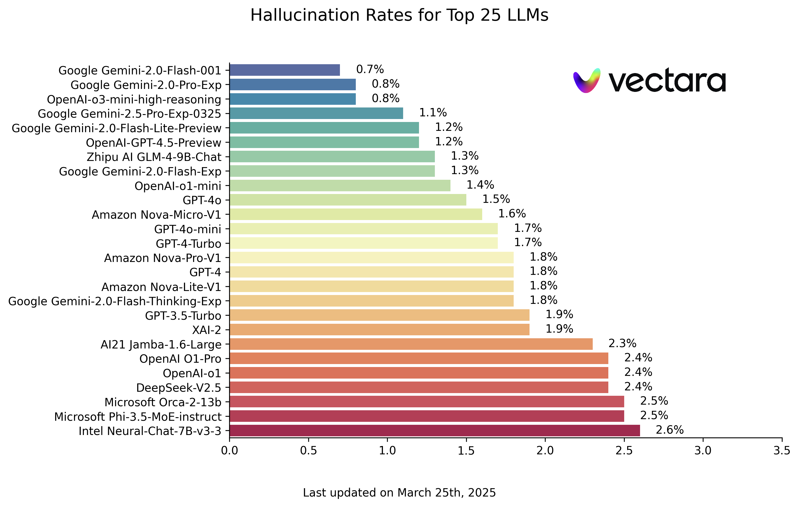

# 幻觉排行榜

本排行榜使用 Vectara 的 [Hughes 幻觉评估模型](https://huggingface.co/vectara/hallucination_evaluation_model) 计算，展示了公开的大语言模型（LLM）在总结文档时产生幻觉的频率。 我们会随着模型和 LLM 的更新，定期更新此排行榜。

您也可以在 Hugging Face 上查看我们的 [幻觉排行榜](https://huggingface.co/spaces/vectara/leaderboard)。

本排行榜的排名是使用 HHEM-2.1 幻觉评估模型计算得出的。 如果您对基于 HHEM-1.0 的旧排行榜感兴趣，请点击 [此处](https://github.com/vectara/hallucination-leaderboard/tree/hhem-1.0-final) 查看。https://github.com/vectara/hallucination-leaderboard/tree/hhem-1.0-final)

最后更新于 2025 年 3 月 25 日

|模型|幻觉率| 事实一致率 |回答率|回答率|
|----|----:|----:|----:|----:|
|Google Gemini-2.0-Flash-001|0.7 %|99.3 %|100.0 %|65.2|
|Google Gemini-2.0-Pro-Exp|0.8 %|99.2 %|99.7 %|61.5|
|OpenAI-o3-mini-high-reasoning|0.8 %|99.2 %|100.0 %|79.5|
|Google Gemini-2.5-Pro-Exp-0325|1.1 %|98.9 %|95.1 %|72.9|
|Google Gemini-2.0-Flash-Lite-Preview|1.2 %|98.8 %|99.5 %|60.9|
|OpenAI-GPT-4.5-Preview|1.2 %|98.8 %|100.0 %|77.0|
|Zhipu AI GLM-4-9B-Chat|1.3 %|98.7 %|100.0 %|58.1|
|Google Gemini-2.0-Flash-Exp|1.3 %|98.7 %|99.9 %|60.0|
|OpenAI-o1-mini|1.4 %|98.6 %|100.0 %|78.3|
|GPT-4o|1.5 %|98.5 %|100.0 %|77.8|
|Amazon Nova-Micro-V1|1.6 %|98.4 %|100.0 %|90.0|
|GPT-4o-mini|1.7 %|98.3 %|100.0 %|76.3|
|GPT-4-Turbo|1.7 %|98.3 %|100.0 %|86.2|
|Google Gemini-2.0-Flash-Thinking-Exp|1.8 %|98.2 %|99.3 %|73.2|
|Amazon Nova-Lite-V1|1.8 %|98.2 %|99.9 %|80.7|
|GPT-4|1.8 %|98.2 %|100.0 %|81.1|
|Amazon Nova-Pro-V1|1.8 %|98.2 %|100.0 %|85.5|
|GPT-3.5-Turbo|1.9 %|98.1 %|99.6 %|84.1|
|XAI-2|1.9 %|98.1|100.0 %|86.5|
|AI21 Jamba-1.6-Large|2.3 %|97.7 %|99.9 %|85.6 |
|OpenAI O1-Pro|2.4 %|97.6 %|100.0 %|81.0|
|OpenAI-o1|2.4 %|97.6 %|99.9 %|73.0|
|DeepSeek-V2.5|2.4 %|97.6 %|100.0 %|83.2|
|Microsoft Orca-2-13b|2.5 %|97.5 %|100.0 %|66.2|
|Microsoft Phi-3.5-MoE-instruct|2.5 %|97.5 %|96.3 %|69.7|
|Intel Neural-Chat-7B-v3-3|2.6 %|97.4 %|100.0 %|60.7|
|Google Gemma-3-12B-Instruct|2.8 %|97.2 %|100.0 %|69.6|
|Qwen2.5-7B-Instruct|2.8 %|97.2 %|100.0 %|71.0|
|AI21 Jamba-1.5-Mini|2.9 %|97.1 %|95.6 %|74.5|
|XAI-2-Vision|2.9 %|97.1|100.0 %|79.8|
|Qwen2.5-Max|2.9 %|97.1 %|88.8 %|90.4|
|Google Gemma-3-27B-Instruct|3.0 %|97.0 %|100.0 %|62.5|
|Snowflake-Arctic-Instruct|3.0 %|97.0 %|100.0 %|68.7|
|Qwen2.5-32B-Instruct|3.0 %|97.0 %|100.0 %|67.9|
|Microsoft Phi-3-mini-128k-instruct|3.1 %|96.9 %|100.0 %|60.1|
|Mistral Small3|3.1 %|96.9 %|100.0 %|74.9|
|OpenAI-o1-preview|3.3 %|96.7 %|100.0 %|119.3|
|Google Gemini-1.5-Flash-002|3.4 %|96.6 %|99.9 %|59.4|
|Microsoft Phi-4-mini-instruct|3.4 %|96.6 %|100.0 %|69.7|
|Google Gemma-3-4B-Instruct|3.7 %|96.3 %|100.0 %|63.7|
|01-AI Yi-1.5-34B-Chat|3.7 %|96.3 %|100.0 %|83.7|
|Llama-3.1-405B-Instruct|3.9 %|96.1 %|99.6 %|85.7|
|DeepSeek-V3|3.9 %|96.1 %|100.0 %|88.2|
|Microsoft Phi-3-mini-4k-instruct|4.0 %|96.0 %|100.0 %|86.8|
|Llama-3.3-70B-Instruct|4.0 %|96.0 %|100.0 %|85.3|
|InternLM3-8B-Instruct|4.0 %|96.0 %|100.0 %|97.5|
|Microsoft Phi-3.5-mini-instruct|4.1 %|95.9 %|100.0 %|75.0|
|Mistral-Large2|4.1 %|95.9 %|100.0 %|77.4|
|Llama-3-70B-Chat-hf|4.1 %|95.9 %|99.2 %|68.5|
|Qwen2-VL-7B-Instruct|4.2 %|95.8 %|100.0 %|73.9|
|Qwen2.5-14B-Instruct|4.2 %|95.8 %|100.0 %|74.8|
|Qwen2.5-72B-Instruct|4.3 %|95.7 %|100.0 %|80.0|
|Llama-3.2-90B-Vision-Instruct|4.3 %|95.7 %|100.0 %|79.8|
|Claude-3.7-Sonnet|4.4 %|95.6 %|100.0 %|97.8|
|Claude-3.7-Sonnet-Think|4.5 %|95.5 %|99.8 %|99.9|
|Cohere Command-A|4.5 %|95.5 %|100.0 %|77.3|
|AI21 Jamba-1.6-Mini|4.6 %|95.4 %|100.0 %|82.3 |
|XAI Grok|4.6 %|95.4 %|100.0 %|91.0|
|Anthropic Claude-3-5-sonnet|4.6 %|95.4 %|100.0 %|95.9|
|Qwen2-72B-Instruct|4.7 %|95.3 %|100.0 %|100.1|
|Microsoft Phi-4|4.7 %|95.3 %|100.0 %|100.3|
|Mixtral-8x22B-Instruct-v0.1|4.7 %|95.3 %|99.9 %|92.0|
|Anthropic Claude-3-5-haiku|4.9 %|95.1 %|100.0 %|92.9|
|01-AI Yi-1.5-9B-Chat|4.9 %|95.1 %|100.0 %|85.7|
|Cohere Command-R|4.9 %|95.1 %|100.0 %|68.7|
|Llama-3.1-70B-Instruct|5.0 %|95.0 %|100.0 %|79.6|
|Google Gemma-3-1B-Instruct|5.3 %|94.7 %|99.9 %|57.9|
|Llama-3.1-8B-Instruct|5.4 %|94.6 %|100.0 %|71.0|
|Cohere Command-R-Plus|5.4 %|94.6 %|100.0 %|68.4|
|Mistral-Small-3.1-24B-Instruct|5.6 %|94.4 %|100.0 %|73.1|
|Llama-3.2-11B-Vision-Instruct|5.5 %|94.5 %|100.0 %|67.3|
|Llama-2-70B-Chat-hf|5.9 %|94.1 %|99.9 %|84.9|
|IBM Granite-3.0-8B-Instruct|6.5 %|93.5 %|100.0 %|74.2|
|Google Gemini-1.5-Pro-002|6.6 %|93.7 %|99.9 %|62.0|
|Google Gemini-1.5-Flash|6.6 %|93.4 %|99.9 %|63.3|
|Mistral-Pixtral|6.6 %|93.4 %|100.0 %|76.4|
|Microsoft phi-2|6.7 %|93.3 %|91.5 %|80.8|
|Google Gemma-2-2B-it|7.0 %|93.0 %|100.0 %|62.2|
|Qwen2.5-3B-Instruct|7.0 %|93.0 %|100.0 %|70.4|
|Llama-3-8B-Chat-hf|7.4 %|92.6 %|99.8 %|79.7|
|Mistral-Ministral-8B|7.5 %|92.5 %|100.0 %|62.7|
|Google Gemini-Pro|7.7 %|92.3 %|98.4 %|89.5|
|01-AI Yi-1.5-6B-Chat|7.9 %|92.1 %|100.0 %|98.9|
|Llama-3.2-3B-Instruct|7.9 %|92.1 %|100.0 %|72.2|
|DeepSeek-V3-0324|8.0 %|92.0 %|100.0 %|78.9|
|Mistral-Ministral-3B|8.3 %|91.7 %|100.0 %|73.2|
|databricks dbrx-instruct|8.3 %|91.7 %|100.0 %|85.9|
|Qwen2-VL-2B-Instruct|8.3 %|91.7 %|100.0 %|81.8|
|Cohere Aya Expanse 32B|8.5 %|91.5 %|99.9 %|81.9|
|IBM Granite-3.1-8B-Instruct|8.6 %|91.4 %|100.0 %|107.4|
|Mistral-Small2|8.6 %|91.4 %|100.0 %|74.2|
|IBM Granite-3.2-8B-Instruct|8.7 %|91.3 %|100.0 %|120.1|
|IBM Granite-3.0-2B-Instruct|8.8 %|91.2 %|100.0 %|81.6|
|Mistral-7B-Instruct-v0.3|9.5 %|90.5 %|100.0 %|98.4|
|Google Gemini-1.5-Pro|9.1 %|90.9 %|99.8 %|61.6|
|Anthropic Claude-3-opus|10.1 %|89.9 %|95.5 %|92.1|
|Google Gemma-2-9B-it|10.1 %|89.9 %|100.0 %|70.2|
|Llama-2-13B-Chat-hf|10.5 %|89.5 %|99.8 %|82.1|
|AllenAI-OLMo-2-13B-Instruct|10.8 %|89.2 %|100.0 %|82.0|
|AllenAI-OLMo-2-7B-Instruct|11.1 %|88.9 %|100.0 %|112.6|
|Mistral-Nemo-Instruct|11.2 %|88.8 %|100.0 %|69.9|
|Llama-2-7B-Chat-hf|11.3 %|88.7 %|99.6 %|119.9|
|Microsoft WizardLM-2-8x22B|11.7 %|88.3 %|99.9 %|140.8|
|Cohere Aya Expanse 8B|12.2 %|87.8 %|99.9 %|83.9|
|Amazon Titan-Express|13.5 %|86.5 %|99.5 %|98.4|
|Google PaLM-2|14.1 %|85.9 %|99.8 %|86.6|
|DeepSeek-R1|14.3 %|85.7 %|100.0%|77.1|
|Google Gemma-7B-it|14.8 %|85.2 %|100.0 %|113.0|
|IBM Granite-3.1-2B-Instruct|15.7 %|84.3 %|100.0 %|107.7|
|Qwen2.5-1.5B-Instruct|15.8 %|84.2 %|100.0 %|70.7|
|Qwen-QwQ-32B-Preview|16.1 %|83.9 %|100.0 %|201.5|
|Anthropic Claude-3-sonnet|16.3 %|83.7 %|100.0 %|108.5|
|IBM Granite-3.2-2B-Instruct|16.5 %|83.5 %|100.0 %|117.7|
|Google Gemma-1.1-7B-it|17.0 %|83.0 %|100.0 %|64.3|
|Anthropic Claude-2|17.4 %|82.6 %|99.3 %|87.5|
|Google Flan-T5-large|18.3 %|81.7 %|99.3 %|20.9|
|Mixtral-8x7B-Instruct-v0.1|20.1 %|79.9 %|99.9 %|90.7|
|Llama-3.2-1B-Instruct|20.7 %|79.3 %|100.0 %|71.5|
|Apple OpenELM-3B-Instruct|24.8 %|75.2 %|99.3 %|47.2|
|Qwen2.5-0.5B-Instruct|25.2 %|74.8 %|100.0 %|72.6|
|Google Gemma-1.1-2B-it|27.8 %|72.2 %|100.0 %|66.8|
|TII falcon-7B-instruct|29.9 %|70.1 %|90.0 %|75.5|

## 模型

此排行榜使用 HHEM-2.1（Vectara 的商业幻觉评估模型）计算大型语言模型（LLM）的排名。您可以在 [Hugging Face](https://huggingface.co/vectara/hallucination_evaluation_model) 和 [Kaggle](https://www.kaggle.com/models/vectara/hallucination_evaluation_model) 上找到该模型的开源变体 HHEM-2.1-Open。

## 数据

参见[此数据集](https://huggingface.co/datasets/vectara/leaderboard_results)，了解我们用来评估模型的生成摘要。

## 先前研究

在该领域已经完成了许多前沿工作。关于该领域的一些顶级论文（摘要中事实一致性），请参见以下内容：

* [SUMMAC: Re-Visiting NLI-based Models for Inconsistency Detection in Summarization](https://aclanthology.org/2022.tacl-1.10.pdf)
* [TRUE: Re-evaluating Factual Consistency Evaluation](https://arxiv.org/pdf/2204.04991.pdf)
* [TrueTeacher: Learning Factual Consistency Evaluation with Large Language Models](https://browse.arxiv.org/pdf/2305.11171v1.pdf)
* [ALIGNSCORE: Evaluating Factual Consistency with A Unified Alignment Function](https://arxiv.org/pdf/2305.16739.pdf)
* [MiniCheck: Efficient Fact-Checking of LLMs on Grounding Documents](https://arxiv.org/pdf/2404.10774)

如需更全面的论文列表，请参见此链接 - https://github.com/EdinburghNLP/awesome-hallucination-detection。以下章节中所描述的方法遵循了这些论文中（以及其他多篇论文）所确立的协议。

## 方法

有关模型发布工作的详细说明，请参阅我们的博客文章：[Cut the Bull…. Detecting Hallucinations in Large Language Models](https://vectara.com/blog/cut-the-bull-detecting-hallucinations-in-large-language-models/)。

为了确定此排行榜，我们训练了一个模型，用于检测大型语言模型输出中的幻觉。我们使用摘要模型事实一致性研究的多个开源数据集进行训练。基于一个与当前最先进模型具有竞争力的模型，我们向上述每个 LLM 提供了 1000 篇短文档，通过其公共 API 请求它们仅根据文档中的事实进行总结。在这 1000 个文档中，仅有 831 篇文档被每个模型总结，其余文档因内容限制至少被一个模型拒绝。基于这 831 篇文档，我们计算了每个模型的总体事实一致性率（无幻觉）和幻觉率（100 减去准确率）。每个模型拒绝响应提示的比率记录在“回答率”列中。发送给模型的内容中不包含非法或“不适合工作场所”的内容，但触发词的存在足以触发某些内容过滤器。文档主要取自 [CNN / Daily Mail Corpus](https://huggingface.co/datasets/cnn_dailymail/viewer/1.0.0/test)。调用 LLM 时，我们将**温度设置为 0**。

我们评估了摘要的事实一致性率，而非整体事实准确率，因为这允许我们将模型的响应与提供的信息进行比较。换句话说，提供的摘要是否与源文档“事实一致”。要确定幻觉对于任何随意的问题来说是不可能的，因为无法准确知道每个 LLM 的训练数据是什么。此外，要拥有一种能够判断任何响应是否为幻觉的模型且无需参考来源，这需要解决幻觉问题，并可能需要训练一个与正在评估的这些 LLM 一样大或更大的模型。因此，我们选择在摘要任务中研究幻觉率，因为这是衡量模型整体真实性的良好模拟。此外，大型语言模型越来越多地被用于 RAG（检索增强生成）管道中回答用户查询，例如在 Bing Chat 和 Google 的聊天集成中。在 RAG 系统中，模型被作为搜索结果的摘要生成器部署，因此该排行榜也是衡量模型在 RAG 系统中使用时准确性的良好指标。

## 使用的提示词

> 您是一个使用数据回答问题的聊天机器人。您必须仅依据所提供的段落中的文本进行回答。您被要求回答的问题是“对以下段落进行简明总结，涵盖描述的核心信息。” &lt;PASSAGE&gt;

在调用 API 时，&lt;PASSAGE&gt; 令牌会被替换为源文档（请参见[此数据集](https://huggingface.co/datasets/vectara/leaderboard_results)中的“source”列）。

## API 集成详情

以下是已集成模型及其具体端点的详细概述：

### OpenAI 模型

- **GPT-3.5**：通过 OpenAI 的 Python 客户端库，使用模型名称 `gpt-3.5-turbo`，通过 `chat.completions.create` 端点访问。
- **GPT-4**：集成了模型标识符 `gpt-4`。
- **GPT-4 Turbo**：根据 OpenAI 文档，使用模型名称 `gpt-4-turbo-2024-04-09`。
- **GPT-4o**：使用模型名称 `gpt-4o` 访问。
- **GPT-4o-mini**：使用模型名称 `gpt-4o-mini` 访问。
- **o1-mini**：使用模型名称 `o1-mini` 访问。
- **o1-preview**：使用模型名称 `o1-preview` 访问。
- **o1**：使用模型名称 `o1` 访问。
- **o1-pro**：使用模型名称 `o1-pro` 访问。
- **o3-mini-high-reasoning**：使用模型名称 `o3-mini` 访问，并设置参数 `reasoning_effort="high"`。
- **GPT-4.5-preview**：使用模型名称 `gpt-4.5-preview-2025-02-27` 访问。

### Llama 模型

- **Llama 2 7B、13B 和 70B**：通过 Anyscale 托管端点访问这些不同规模的模型，使用模型 `meta-llama/Llama-2-xxb-chat-hf`，其中 `xxb` 可以是 `7b`、`13b` 或 `70b`，根据每个模型的能力进行调整。
- **Llama 3 8B 和 70B**：这些模型通过 Together AI 的 `chat` 端点访问，并使用模型 `meta-llama/Llama-3-xxB-chat-hf`，其中 `xxB` 可以是 `8B` 和 `70B`。
- **Llama 3.1 8B、70B 和 405B**：模型 [meta-llama/Meta-Llama-3.1-70B-Instruct](https://huggingface.co/meta-llama/Meta-Llama-3.1-70B-Instruct) 和 [meta-llama/Meta-Llama-3.1-8B-Instruct](https://huggingface.co/meta-llama/Meta-Llama-3.1-8B-Instruct) 是通过 Hugging Face 的检查点访问的。模型 `Meta-Llama-3.1-405B-Instruct` 是通过 Replicate 的 API 使用模型 `meta/meta-llama-3.1-405b-instruct` 访问的。
- **Llama 3.2 1B 和 3B**：模型 [meta-llama/Meta-Llama-3.2-1B-Instruct](https://huggingface.co/meta-llama/Meta-Llama-3.2-1B-Instruct) 是通过 Hugging Face 的检查点访问的。模型 `Meta-Llama-3.2-3B-Instruct` 是通过 Together AI 的 `chat` 端点使用模型 `meta-llama/Llama-3.2-3B-Instruct-Turbo` 访问的。
- **Llama 3.2 Vision 11B 和 90B**：模型 `Llama-3.2-11B-Vision-Instruct` 和 `Llama-3.2-90B-Vision-Instruct` 是通过 Together AI 的 `chat` 端点使用模型 `meta-llama/Llama-3.2-11B-Vision-Instruct-Turbo` 和 `meta-llama/Llama-3.2-90B-Vision-Instruct-Turbo` 访问的。
- **Llama 3.3 70B**：模型 [meta-llama/Llama-3.3-70B-Instruct](https://huggingface.co/meta-llama/Llama-3.3-70B-Instruct) 是通过 Hugging Face 的检查点访问的。

### Cohere 模型

- **Cohere Command R**：通过 `/chat` 端点使用模型 `command-r-08-2024`。
- **Cohere Command R Plus**：通过 `/chat` 端点使用模型 `command-r-plus-08-2024`。
- **Aya Expanse 8B、32B**：通过使用模型 `c4ai-aya-expanse-8b` 和 `c4ai-aya-expanse-32b` 访问。
- **Cohere Command A**：通过 `/chat` 端点使用模型 `command-a-03-2025`。
  有关 Cohere 模型的更多信息，请参考其[网站](https://docs.cohere.com/docs/models)。

### Anthropic 模型

- **Claude 2**：通过 API 调用模型 `claude-2.0`。
- **Claude 3 Opus**：通过 API 调用模型 `claude-3-opus-20240229`。
- **Claude 3 Sonnet**：通过 API 调用模型 `claude-3-sonnet-20240229`。
- **Claude 3.5 Sonnet**：通过 API 调用模型 `claude-3-5-sonnet-20241022`。
- **Claude 3.5 Haiku**：通过 API 调用模型 `claude-3-5-haiku-20241022`。
- **Claude 3.7 Sonnet/Sonnet-Thinking**：通过 API 调用模型 `claude-3-7-sonnet-20250219`。
  有关每个模型的详细信息，请参见其[网站](https://docs.anthropic.com/claude/docs/models-overview)。

### Mistral AI 模型

- **Mixtral 8x7B**：[Mixtral-8x7B-Instruct-v0.1](https://huggingface.co/mistralai/Mixtral-8x7B-Instruct-v0.1) 模型通过 Hugging Face 的 API 访问。
- **Mixtral 8x22B**：通过 Together AI 的 API 使用模型 `mistralai/Mixtral-8x22B-Instruct-v0.1` 和 `chat` 端点访问。
- **Mistral Pixtral Large**：通过 Mistral AI 的 API 使用模型 `pixtral-large-latest`。
- **Mistral Large2**：通过 Mistral AI 的 API 使用模型 `mistral-large-latest`。
- **Mistral Small2**：通过 Mistral AI 的 API 使用模型 `mistral-small-latest`。
- **Mistral Small3**：[Mistral Small3](https://huggingface.co/mistralai/Mistral-Small-24B-Instruct-2501) 模型通过加载 Hugging Face 的检查点访问。
- **Mistral-Small-3.1-24B-Instruct**：[Mistral Small 3.1](https://huggingface.co/mistralai/Mistral-Small-3.1-24B-Instruct-2503) 模型通过加载 Hugging Face 的检查点访问。
- **Mistral-7B-Instruct-v0.3**：[Mistral-7B-Instruct-v0.3](https://huggingface.co/mistralai/Mistral-7B-Instruct-v0.3) 模型通过加载 Hugging Face 的检查点访问。
- **Mistral-Nemo-Instruct**：[Mistral-Nemo-Instruct-2407](https://huggingface.co/mistralai/Mistral-Nemo-Instruct-2407) 模型通过 Hugging Face 的检查点访问。
- **Mistral Ministral 3B**：通过 Mistral AI 的 API 使用模型 `ministral-3b-latest`。
- **Mistral Ministral 8B**：通过 Mistral AI 的 API 使用模型 `ministral-8b-latest`。

### Google 封闭源代码模型（通过 Vertex AI）

- **Google Palm 2**：使用 `text-bison-001` 模型实现。
- **Gemini Pro**：Google 的 `gemini-pro` 模型被集成用于增强语言处理功能，可通过 Vertex AI 访问。
- **Gemini 1.5 Pro**：通过 Vertex AI 使用模型 `gemini-1.5-pro-001`。
- **Gemini 1.5 Flash**：通过 Vertex AI 使用模型 `gemini-1.5-flash-001`。
- **Gemini 1.5 Pro 002**：通过 Vertex AI 使用模型 `gemini-1.5-pro-002`。
- **Gemini 1.5 Flase 002**：通过 Vertex AI 使用模型 `gemini-1.5-flash-002`。
- **Gemini 2.0 Flash Exp**：通过 Vertex AI 使用模型 `gemini-2.0-flash-exp`。
- **Gemini 2.0 Flash**：通过 Vertex AI 使用模型 `gemini-2.0-flash-001`。
- **Gemini 2.0 Flash Lite**：通过 Vertex AI 使用模型 `gemini-2.0-flash-lite-preview-02-05`。
- **Gemini 2.0 Flash Thinking Exp**：通过 Vertex AI 使用模型 `gemini-2.0-flash-thinking-exp`。
- **Gemini 2.0 Pro Exp**：通过 Vertex AI 使用模型 `gemini-2.0-pro-exp-02-05`。
- **Gemini 2.5 Pro Exp**：通过 Vertex AI 使用模型 `gemini-2.5-pro-exp-03-25`。

### Google 开源模型（通过 Hugging Face）

- **Google flan-t5-large**：[flan-t5-large](https://huggingface.co/google/flan-t5-large) 模型通过 Hugging Face 的 API 访问。
- **Google gemma-7b-it**：[gemma-7b-it](https://huggingface.co/google/gemma-7b-it) 模型通过 Hugging Face 的 API 访问。
- **Google gemma-1.1-7b-it**：[gemma-1.1-7b-it](https://huggingface.co/google/gemma-1.1-7b-it) 模型通过加载 Hugging Face 的检查点访问。
- **Google gemma-1.1-2b-it**：[gemma-1.1-2b-it](https://huggingface.co/google/gemma-1.1-2b-it) 模型通过加载 Hugging Face 的检查点访问。
- **Google gemma-2-9b-it**：[gemma-2-9b-it](https://huggingface.co/google/gemma-2-9b-it) 模型通过加载 Hugging Face 的检查点访问。
- **Google gemma-2-2b-it**：[gemma-2-2b-it](https://huggingface.co/google/gemma-2-2b-it) 模型通过加载 Hugging Face 的检查点访问。
- **Google gemma-3-1b/4b/12b/27b-it**：[gemma-3-1b-it](https://huggingface.co/google/gemma-3-1b-it)、[gemma-3-4b-it](https://huggingface.co/google/gemma-3-4b-it)、[gemma-3-12b-it](https://huggingface.co/google/gemma-3-12b-it)、[gemma-3-27b-it](https://huggingface.co/google/gemma-3-27b-it) 模型通过加载 Hugging Face 的检查点访问。

如需深入了解 Google 提供的每个模型的版本和生命周期，请参阅 Vertex AI 的[模型版本和生命周期](https://cloud.google.com/vertex-ai/docs/generative-ai/learn/model-versioning)。

### 亚马逊模型

- **Amazon Titan Express**：[模型](https://aws.amazon.com/bedrock/titan/)通过 Amazon Bedrock 使用模型标识符 `amazon.titan-text-express-v1` 访问。
- **Amazon Nova V1 Pro、Lite、Micro**：Amazon Nova V1 [Pro](https://openrouter.ai/amazon/nova-pro-v1)、[Lite](https://openrouter.ai/amazon/nova-lite-v1)、[Micro](https://openrouter.ai/amazon/nova-micro-v1) 通过 OpenRouter API 访问，并设置参数 `"temperature": 0`。

### 微软模型

- **Microsoft Phi-2**：[phi-2](https://huggingface.co/microsoft/phi-2) 模型通过 Hugging Face 的 API 访问。
- **Microsoft Orca-2-13b**：[Orca-2-13b](https://huggingface.co/microsoft/Orca-2-13b) 模型通过 Hugging Face 的 API 访问。
- **Microsoft WizardLM-2-8x22B**：通过 Together AI 的 API 使用模型 `microsoft/WizardLM-2-8x22B` 和 `chat` 端点访问。
- **Microsoft Phi-3-mini-4k**：[phi-3-mini-4k](https://huggingface.co/microsoft/Phi-3-mini-4k-instruct) 模型通过 Hugging Face 的检查点访问。
- **Microsoft Phi-3-mini-128k**：[phi-3-mini-128k](https://huggingface.co/microsoft/Phi-3-mini-128k-instruct) 模型通过 Hugging Face 的检查点访问。
- **Microsoft Phi-3.5-mini-instruct**：[phi-3.5-mini-instruct](https://huggingface.co/microsoft/Phi-3.5-mini-instruct) 模型通过 Hugging Face 的检查点访问。
- **Microsoft Phi-3.5-MoE-instruct**：[phi-3.5-MoE-instruct](https://huggingface.co/microsoft/Phi-3.5-MoE-instruct) 模型通过 Hugging Face 的检查点访问。
- **Microsoft Phi-4/Phi-4-Mini**：[phi-4](https://huggingface.co/microsoft/phi-4) 和 [phi-4-mini](https://huggingface.co/microsoft/Phi-4-mini-instruct) 模型通过 Hugging Face 的检查点访问。

### TII 模型（通过 Hugging Face）

- **tiiuae/falcon-7b-instruct**：[falcon-7b-instruct](https://huggingface.co/tiiuae/falcon-7b-instruct) 模型通过 Hugging Face 的 API 访问。

### 英特尔模型（通过 Hugging Face）

- **Intel/neural-chat-7b-v3-3**：[Intel/neural-chat-7b-v3-3](https://huggingface.co/Intel/neural-chat-7b-v3-3) 模型通过 Hugging Face 的检查点访问。

### Databricks 模型

- **Databricks/dbrx-instruct**：通过 Together AI 的 API 使用模型 `databricks/dbrx-instruct` 和 `chat` 端点访问。

### 雪花模型

- **Snowflake/snowflake-arctic-instruct**：通过 Replicate 的 API 使用模型 `snowflake/snowflake-arctic-instruct` 访问。

### 苹果模型

- **Apple/OpenELM-3B-Instruct**：[OpenELM-3B-Instruct](https://huggingface.co/apple/OpenELM-3B-Instruct) 模型通过加载 Hugging Face 的检查点访问。此模型的提示词为原始提示词加上 ''\n\nA concise summary is as follows:''。

### 01-AI 模型

- **01-AI/Yi-1.5-Chat 6B、9B、34B**：[01-ai/Yi-1.5-6B-Chat](https://huggingface.co/01-ai/Yi-1.5-6B-Chat)、[01-ai/Yi-1.5-9B-Chat](https://huggingface.co/01-ai/Yi-1.5-9B-Chat)、[01-ai/Yi-1.5-34B-Chat](https://huggingface.co/01-ai/Yi-1.5-34B-Chat) 模型通过 Hugging Face 的检查点访问。

### 智谱 AI 模型

- **Zhipu-AI/GLM-4-9B-Chat**：[GLM-4-9B-Chat](https://huggingface.co/THUDM/glm-4-9b-chat) 通过 Hugging Face 的检查点访问。

### Qwen 模型

- **Qwen/Qwen2-72B-Instruct**：通过 Together AI 的 `chat` 端点使用模型名称 `Qwen/Qwen2-72B-Instruct` 访问。
- **Qwen/Qwen2-VL-Instruct 2B、7B**：[Qwen/Qwen2-VL-2B-Instruct](https://huggingface.co/Qwen/Qwen2-VL-2B-Instruct) 和 [Qwen/Qwen2-VL-7B-Instruct](https://huggingface.co/Qwen/Qwen2-VL-7B-Instruct) 模型通过 Hugging Face 的检查点访问。
- **Qwen/Qwen2.5-Instruct 0.5B、1.5B、3B、7B、14B、32B、72B**：[Qwen2.5-0.5B-Instruct](https://huggingface.co/Qwen/Qwen2.5-0.5B-Instruct)、[Qwen2.5-1.5B-Instruct](https://huggingface.co/Qwen/Qwen2.5-1.5B-Instruct)、[Qwen2.5-3B-Instruct](https://huggingface.co/Qwen/Qwen2.5-3B-Instruct)、[Qwen2.5-7B-Instruct](https://huggingface.co/Qwen/Qwen2.5-7B-Instruct)、[Qwen2.5-14B-Instruct](https://huggingface.co/Qwen/Qwen2.5-14B-Instruct)、[Qwen2.5-32B-Instruct](https://huggingface.co/Qwen/Qwen2.5-32B-Instruct)、[Qwen2.5-72B-Instruct](https://huggingface.co/Qwen/Qwen2.5-72B-Instruct) 模型通过 Hugging Face 的检查点访问。
- **Qwen/QwQ-32B-Preview**：[Qwen/QwQ-32B-Preview](https://huggingface.co/Qwen/QwQ-32B-Preview) 模型通过 Hugging Face 的检查点访问。
- **Qwen2.5-Max**：[Qwen2.5-max](https://openrouter.ai/qwen/qwen-max) 模型通过 OpenRouter API 访问，并设置参数 `"temperature": 0`。

### AI21 模型

- **AI21-Jamba-1.5-Mini**：[Jamba-1.5-Mini](https://huggingface.co/ai21labs/AI21-Jamba-1.5-Mini) 模型通过 Hugging Face 的检查点访问。
- **AI21 Jamba-1.6-Large / Mini**：[Jamba-1.6-Large](https://openrouter.ai/ai21/jamba-1.6-large) 和 [Jamba-1.6-Mini](https://openrouter.ai/ai21/jamba-1.6-mini) 模型通过 OpenRouter API 访问，端点分别为 `ai21/jamba-1.6-large` 和 `ai21/jamba-1.6-mini`。

### DeepSeek 模型

- **DeepSeek V2.5**：通过 DeepSeek 的 API 使用模型 `deepseek-chat` 和 `chat` 端点访问。
- **DeepSeek V3**：通过 DeepSeek 的 API 使用模型 `deepseek-chat` 和 `chat` 端点访问。
- **DeepSeek V3-0324**：通过 DeepSeek 的 API 使用模型 `deepseek-chat` 和 `chat` 端点访问。
- **DeepSeek R1**：通过 DeepSeek 的 API 使用模型 `deepseek-reasoner` 和 `reasoner` 端点访问。

### IBM 模型

- **Granite-3.0-Instruct 2B、8B**：[ibm-granite/granite-3.0-8b-instruct](https://huggingface.co/ibm-granite/granite-3.0-8b-instruct) 和 [ibm-granite/granite-3.0-2b-instruct](https://huggingface.co/ibm-granite/granite-3.0-2b-instruct) 模型通过 Hugging Face 的检查点访问。
- **Granite-3.1-Instruct 2B、8B**：[ibm-granite/granite-3.1-8b-instruct](https://huggingface.co/ibm-granite/granite-3.1-8b-instruct) 和 [ibm-granite/granite-3.1-2b-instruct](https://huggingface.co/ibm-granite/granite-3.1-2b-instruct) 模型通过 Hugging Face 的检查点访问。
- **Granite-3.2-Instruct 2B、8B**：[ibm-granite/granite-3.2-8b-instruct](https://huggingface.co/ibm-granite/granite-3.2-8b-instruct) 和 [ibm-granite/granite-3.2-2b-instruct](https://huggingface.co/ibm-granite/granite-3.2-2b-instruct) 模型通过 Hugging Face 的检查点访问。摘要生成时设置 `thinking=True`。

### X AI 模型

- **Grok**：通过 xAI 的 API 使用模型 `grok-beta` 和 `chat/completions` 端点访问。
- **Grok-2**：[模型](https://openrouter.ai/x-ai/grok-2-1212) 通过 OpenRouter API 访问，端点为 `x-ai/grok-2-1212`。
- **Grok-2-Vision**：[模型](https://openrouter.ai/x-ai/grok-2-vision-1212) 通过 OpenRouter API 访问，端点为 `x-ai/grok-2-vision-1212`。

### AllenAI 模型

- **OLMo-2 7B、13B**：[allenai/OLMo-2-1124-7B-Instruct](https://huggingface.co/allenai/OLMo-2-1124-7B-Instruct) 和 [allenai/OLMo-2-1124-13B-Instruct](https://huggingface.co/allenai/OLMo-2-1124-13B-Instruct) 模型通过 Hugging Face 的检查点访问。

### InternLM 模型

- **InternLM3-8B-Instruct**：[internlm/internlm3-8b-instruct](https://huggingface.co/internlm/internlm3-8b-instruct) 模型通过 Hugging Face 的检查点访问。

## 常见问题

* **问：** 为什么使用模型来评估模型？
* **答：** 有几个原因促使我们选择这种方法，而不是使用人工评估。虽然我们可以进行大规模人工评价，但这种方法只适用于一次性评估，无法随着新 API 上线或模型更新而不断更新排行榜。我们的领域变化迅速，任何这样的过程在发布后都会迅速过时。其次，我们希望有一个可重复的过程，可以与他人共享，使他们可以在评估自己的模型时使用它作为众多 LLM 质量评分之一。人工标注的过程仅能分享标注方法和人工标签，无法共享具体的模型检测过程。此外，开发一个用于检测幻觉的模型**比开发一个永不产生幻觉的生成模型容易得多**。只要幻觉评估模型与人工评分高度相关，就可以成为人工评分的良好代理。我们特别针对的是摘要任务，而不是一般的“开放性问题回答”，因此训练的 LLM 不需要记住大量人类知识，只需要对其支持的语言有坚实的掌握和理解（目前仅限英语，但我们计划扩展语言覆盖范围）。

* **问：** 如果 LLM 拒绝总结文档或仅提供一两个字的答案怎么办？
* **答：** 我们明确过滤了这些情况。更多信息请参见我们的[博客文章](https://vectara.com/blog/cut-the-bull-detecting-hallucinations-in-large-language-models/)。排行榜上的“回答率”列显示了总结文档的百分比，“平均摘要长度”列则展示了摘要的长度，说明大多数文档没有非常短的答案。

* **问：** 使用的是哪个版本的模型 XYZ？
* **答：** 请参阅 API 详细信息部分，了解使用的模型版本以及调用方式的具体信息，以及排行榜最后一次更新的日期。如果需要进一步说明，请联系我们（在仓库中创建问题）。

* **问：** 模型是否可以通过不回答或提供非常短的答案来获得 100% 的评分？
* **答：** 我们明确过滤掉了每个模型的这种响应，最终评估仅针对所有模型都为其提供了摘要的文档完成。有关技术细节，请参阅我们关于该主题的[博客文章](https://vectara.com/blog/cut-the-bull-detecting-hallucinations-in-large-language-models/)。同时参见表格中的“回答率”和“平均摘要长度”列。

* **问：** 一个仅从原始摘要中复制粘贴内容的提取式摘要模型在此任务中会不会获得 100% 的评分（0 幻觉率）？
* **答：** 当然会，因为这种模型定义上没有幻觉并提供忠实的摘要。但我们并未声称要评估摘要质量，这是一个单独的**正交**任务，应独立评估。我们**不**在评估摘要质量，而仅评估它们的**事实一致性**，正如我们在[博客文章](https://vectara.com/cut-the-bull-detecting-hallucinations-in-large-language-models/)中所指出的。

* **问：** 这个指标似乎很容易被利用，可以通过将原始文本作为摘要复制粘贴来实现高分？
* **答：** 的确如此，但我们并不针对随机模型进行此方法的评估，例如 Kaggle 比赛。如果任何模型这样做，它在您关心的其他任务中表现也会很差。因此，我认为这种质量指标可以作为您为模型运行的其他评估的一部分，比如摘要质量、问题回答准确性等。但我们并不建议将其作为独立指标。所选择的模型均未通过我们模型的输出进行训练。这种情况在未来可能发生，但由于我们计划更新模型以及源文档，这是一个动态排行榜，这种情况发生的可能性较低。但这同样是任何 LLM 基准测试的一个问题。我们还要指出，这基于事实一致性的庞大研究工作，许多其他学者发明并完善了这个协议。更多内容请参阅我们在[博客文章](https://vectara.com/blog/cut-the-bull-detecting-hallucinations-in-large-language-models/)中引用的 SummaC 和 True 论文，以及这个优秀的资源汇编 - https://github.com/EdinburghNLP/awesome-hallucination-detection。

* **问：** 这个方法无法完全测量模型可能幻觉的所有方式？
* **答：** 同意。我们并未声称已经解决了幻觉检测的问题，计划进一步扩展和改进此过程。但我们确实认为这是朝正确方向迈出的一步，为大家提供了一个急需的起点，可以在此基础上进一步构建。

* **问：** 有些模型可能只在摘要中产生幻觉。是否可以提供一份众所周知的事实列表，查看模型能否正确回忆？
* **答：** 我认为这不是一个好的测试。首先，除非您训练了模型，否则您不知道它的训练数据是什么，因此无法确定模型是否根据其已见的数据在做出回应还是在猜测。此外，“众所周知”没有明确的定义，这类数据通常很容易被大多数模型准确回忆。根据我的主观经验，大多数幻觉来自模型提取非常少见或讨论度极低的信息，或针对模型已见到冲突信息的事实。如果不知道模型的训练数据，也就无法验证这类幻觉，因为您不知道哪些数据符合这些条件。我也认为模型仅在摘要中出现幻觉的可能性较低。我们要求模型将信息进行变换，同时仍然忠实于来源。这类似于摘要之外的许多生成任务（例如编写覆盖这些要点的电子邮件……），如果模型偏离了提示词，那就是未能遵循指令，这表明模型在其他指令遵循任务中也会有问题。

* **问：** 这是一个好的开始，但远未最终解决问题？
* **答：** 完全赞同。还有很多工作需要完成，这个问题也远未解决。但“好的开始”意味着希望这一领域会开始取得进展，通过开源模型，我们希望吸引社区将其提升到更高水平。

## 即将上线

* 我们将添加一个关于引用准确性排行榜。作为 RAG 系统的开发者，我们注意到 LLM 有时会在根据提供的搜索结果回答问题时误归因来源。我们希望能够测量这一点，以帮助缓解我们平台中的问题。
* 我们还计划扩展基准测试以涵盖其他 RAG 任务，例如多文档摘要。
* 我们还计划覆盖不仅仅是英语的更多语言。我们的当前平台覆盖超过 100 种语言，我们希望开发具有可比多语种覆盖率的幻觉检测器。

